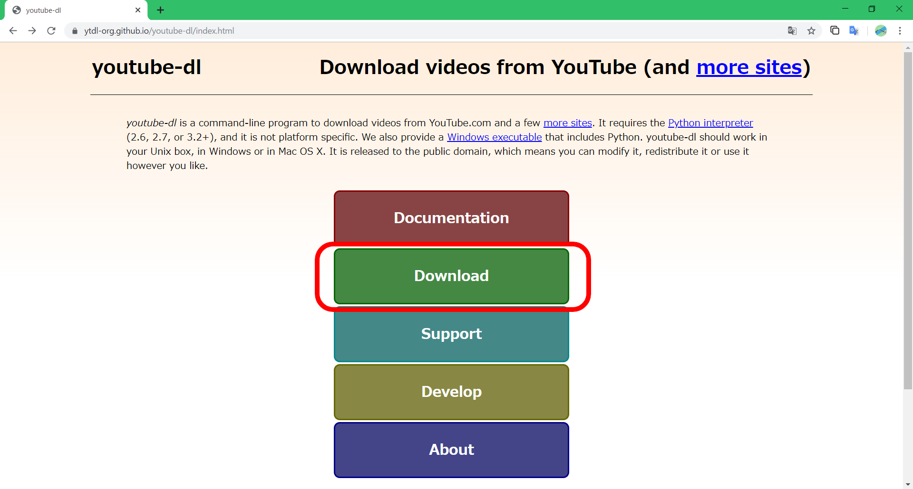
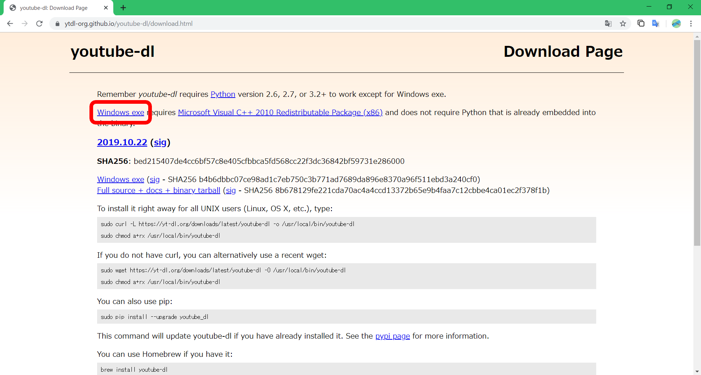

# youtube-dlを使う

## youtube-dlとは

youtube-dlは、Youtubeの動画をダウンロードできるCLIツールです。

ちなみにPython製です。

<br>

+ 画質を選べる
  + 高画質（フルHD）
  + 低画質 ...
+ 音声のみ
+ ストリーミング配信対応

などなど、いろいろできます。

<br>

Youtubeだけでなく、niconicoだったりgyaoだったりでもダウンロード可能なのでやってみると面白いかも…？

> FFmpegを入れておくと画質面などで良かったりします。
>
> ::: tip Tip
> FFmpegのインストールは以下を参照
> （なんかリンクはるか書くか）
> :::

## インストール

以下の2つを使用する場合は、自動的にパスが設定されるのでパスを通す必要はないです。

### Scoop

```sh
$ scoop install youtube-dl
```

### Python（pip）

```sh
$ pip install youtube-dl
```

---

### EXE（実行ファイル）

パスは自分で設定します。

1. [ここ](https://ytdl-org.github.io/youtube-dl/index.html)にアクセスします

2. `Download`をクリックします

   

3. `Windows.exe`をクリックすると、ダウンロードが始まります

   

4. ダウンロードしたファイルを、別の場所に移すなどしてパスを通します

   ::: tip Tip

   パスの設定方法は以下を参照（リンクはるか書くか）

   :::

<br>

**インストール確認**

```sh
$ youtube-dl --version
```

コマンドを実行してエラーが出ていなければOKです。

## 使い方

よく使うコマンド例です。（随時更新）

### ダウンロード（オプションなし）

```sh
$ youtube-dl <url>
```

### 音声のみ

```sh
$ youtube-dl -x <url>
```

