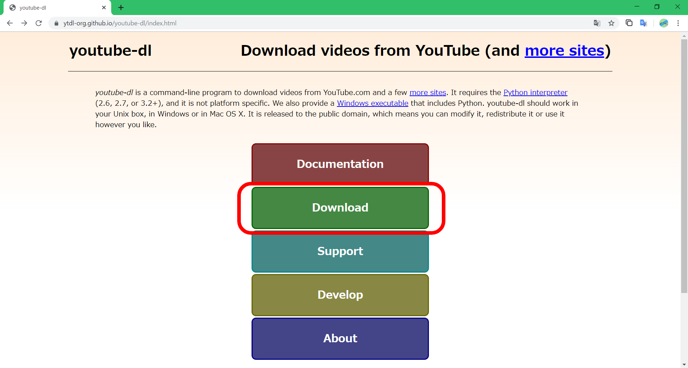
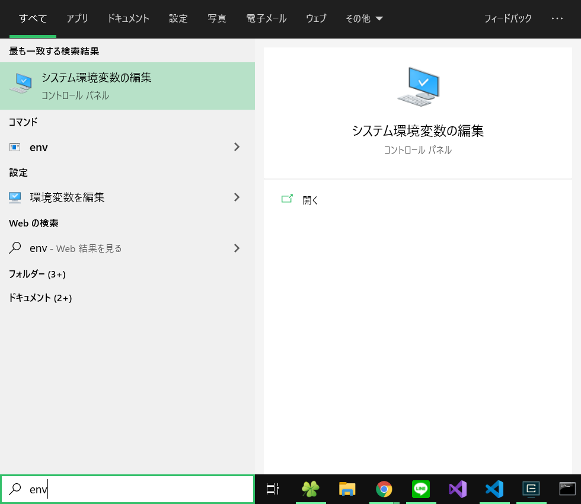

# youtube-dlを使う

## youtube-dlとは

youtube-dlは、Youtubeの動画をダウンロードできるCLIツールです。

ちなみにPython製です。

<br>

+ 画質を選べる
  + 高画質（フルHD）
  + 低画質 ...
+ 音声のみ
+ ストリーミング配信対応

などなど、いろいろできます。

<br>

Youtubeだけでなく、niconicoだったりgyaoだったりでもダウンロード可能なのでやってみると面白いかも？

> FFmpegを入れておくと画質面などで良かったりします。
>
> ::: tip Tip
>
> FFmpegはここからインストールできます。
>
> [https://www.ffmpeg.org/](https://www.ffmpeg.org/)
>
> :::

## インストール

以下の2つを使用する場合は、自動的にパスが設定されるのでパスを通す必要はないです。

### Scoop

```sh
$ scoop install youtube-dl
```

### Python（pip）

```sh
$ pip install youtube-dl
```

---

### EXE（実行ファイル）

パスは自分で設定します。

1. [ここ](https://ytdl-org.github.io/youtube-dl/index.html)にアクセスします

2. `Download`をクリックします

   

3. `Windows.exe`をクリックすると、ダウンロードが始まります

   

4. ダウンロードしたファイルを、別の場所に移すなどしてパスを通します

   ::: tip 環境変数の設定方法

   <br>

   <details><summary>クリックして展開</summary>

   <dir>

   1. スタートメニュー（Windowsキー）で`env`と入力し、**システム環境変数の編集**をクリックします

      

   2. `環境変数（N）`をクリックします

   3. **ユーザー環境変数**の中から`Path`をクリックして、`編集`を選択します

   4. `新規`をクリックし、`.exe`を置いたディレクトリのパスを指定します

   5. `OK`をクリックして適用します

   </dir></details>

   <br>

   :::

<br>

**インストール確認**

```sh
$ youtube-dl --version
```

コマンドを実行してエラーが出ていなければOKです。

## 使い方

よく使うコマンド例です。（随時更新）

### ダウンロード（オプションなし）

```sh
$ youtube-dl <url>
```

### 音声のみ

```sh
$ youtube-dl -x <url>
```

### ダウンロードフォーマットを取得

```sh
$ youtube-dl -F <url>
```

### ダウンロードフォーマットを指定


```

```

