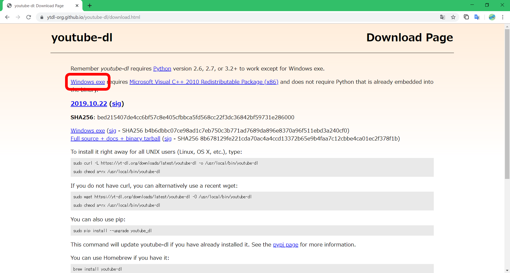

# youtube-dlの使い方

## youtube-dlとは

youtube-dlは、Youtubeの動画をダウンロードできるCLIツールです。

ちなみにPython製です。

<br>

+ 画質を選べる
  + 高画質（フルHD）
  + 低画質 ...
+ 音声のみ
+ ストリーミング配信対応
+ 自動化

などなど、いろいろできます。

<br>

Youtubeだけでなく、niconicoだったりgyaoだったりでもダウンロード可能なのでやってみると面白いかも？

> FFmpegを入れておくと画質面などで良かったりするのでおすすめ。
>
> ::: tip Tip
>
> FFmpegはここからインストールできます。
>
> [https://www.ffmpeg.org/](https://www.ffmpeg.org/)
>
> :::

## インストール

以下の2つを使用する場合は、自動的にパスが設定されるのでパスを通す必要はないです。

### ◆ Scoop

```sh
$ scoop install youtube-dl
```

### ◆ Python（pip）

```sh
$ pip install youtube-dl
```

---

### ◆ EXE（実行ファイル）

<details><summary>クリックして展開</summary>

<div>

パスは自分で設定します。

1. [ここ](https://ytdl-org.github.io/youtube-dl/index.html)にアクセスします

2. `Download`をクリックします

   

3. `Windows.exe`をクリックすると、ダウンロードが始まります

   

4. ダウンロードしたファイルを、別の場所に移すなどしてパスを通します

   ::: tip 環境変数の設定方法

   <br>

   <details><summary>クリックして展開</summary>
    <div>

    1. スタートメニュー（Windowsキー）で`env`と入力し、**システム環境変数の編集**をクリックします

       

    2. `環境変数（N）`をクリックします

    3. **ユーザー環境変数**の中から`Path`をクリックして、`編集`を選択します

    4. `新規`をクリックし、`.exe`を置いたディレクトリのパスを指定します

    5. `OK`をクリックして適用します

    </div></details>

    <br>

    :::

</div></details>

<br>

**インストール確認**

```sh
$ youtube-dl --version
```

コマンドを実行してエラーが出ていなければOKです。

## 使い方

よく使うコマンド例です。

### ◆ ダウンロード

一番基本のダウンロード方法です。

画質・音質は決められたものがダウンロードされます。

> option：なし

```sh
$ youtube-dl <url>
```

### ◆ 音のみ

音のみをダウンロードできます。

> option：`-x` / `--extract-audio`

```sh
$ youtube-dl -x <url>
# or
$ youtube-dl --extract-audio <url>
```

### ◆ ダウンロード可能なフォーマットリストを取得

YouTubeのリンクからダウンロード可能なフォーマットリストを取得します。

> option：`-F` / `--list-formats`

```sh
$ youtube-dl -F <url>
# or
$ youtube-dl --list-formats <url>
```

※ ダウンロードは実行されません。

`audio only tiny`と書かれているものは音フォーマットで、それ以外は動画フォーマットです。

> <details><summary>実行例（クリックして展開）</summary>
>
> <div>
>
> ```
> [youtube] 9sc0miJOvjQ: Downloading webpage
> [youtube] 9sc0miJOvjQ: Downloading video info webpage
> [info] Available formats for 9sc0miJOvjQ:
> format code  extension  resolution note
> 249          webm       audio only tiny   53k , opus @ 50k (48000Hz), 1.39MiB
> 250          webm       audio only tiny   71k , opus @ 70k (48000Hz), 1.85MiB
> 140          m4a        audio only tiny  131k , m4a_dash container, mp4a.40.2@128k (44100Hz), 3.75MiB
> 251          webm       audio only tiny  134k , opus @160k (48000Hz), 3.69MiB
> 160          mp4        146x144    144p   50k , avc1.4d400b, 25fps, video only, 736.23KiB
> 278          webm       146x144    144p   69k , webm container, vp9, 25fps, video only, 940.67KiB
> 133          mp4        242x240    240p  113k , avc1.4d400c, 25fps, video only, 1.55MiB
> 242          webm       242x240    240p  155k , vp9, 25fps, video only, 1.81MiB
> 134          mp4        362x360    360p  207k , avc1.4d4015, 25fps, video only, 3.04MiB
> 243          webm       362x360    360p  264k , vp9, 25fps, video only, 3.00MiB
> 135          mp4        484x480    480p  422k , avc1.4d401e, 25fps, video only, 5.33MiB
> 244          webm       484x480    480p  446k , vp9, 25fps, video only, 5.13MiB
> 247          webm       726x720    720p  835k , vp9, 25fps, video only, 10.33MiB
> 136          mp4        726x720    720p  939k , avc1.4d401f, 25fps, video only, 11.25MiB
> 18           mp4        364x360    360p  342k , avc1.42001E, mp4a.40.2@ 96k (44100Hz), 9.91MiB (best)
> ```
>
> </div></details>

### ◆ ダウンロードフォーマットを指定

`-F`で取得したフォーマットでダウンロードします。

> option：`-f` / `--format`

```sh
$ youtube-dl -f <fmt> <url>
# or
$ youtube-dl --format <fmt> <url>
```

### ◆ 最高画質をダウンロード

`bestvideo`で最高画質を指定します。

```sh
$ youtube-dl -f bestvideo <url>
```

#### 拡張子を指定する

`[ext=mp4]`の部分で拡張子を指定します。

フォーマットリストにないものはできないので、mp4が無難です。

```sh
$ youtube-dl -f bestvideo[ext=mp4] <url>
```

::: warning Note

画質を指定すると動画のみダウンロードされ、音は含まれていない。  
そのため、オプションで結合するように書く必要があります。

参照：[#画質と音質を指定する](#◆-画質と音質を指定する)

:::

### ◆ 最高音質をダウンロード

`bestaudio`で最高音質を指定します。

```sh
$ youtube-dl -f bestaudio <url>
```

#### 拡張子を指定する

最高画質のときと同じように、`[ext=m4a]`の部分で拡張子を指定します。

フォーマットリストにないものはできないので、m4aが無難です。

```sh
$ youtube-dl -f bestaudio[ext=m4a] <url>
```

### ◆ 画質と音質を指定する

画質・音質は`+`を使って指定します。

`動画フォーマット` ＋ `音フォーマット`の順に連結します。

```sh
$ youtube-dl -f <video_fmt>+<audio_fmt> <url>
```

※ ただし、これだけでは動画・音のファイルが個々のファイルとしてダウンロードされてしまうため、1つのファイルにするには、次に記述するマージをオプションに指定する必要があります。

```sh
$ youtube-dl -f <video_fmt>+<audio_fmt> --merge-output-format mp4 <url>
```

マージのフォーマットはmp4のほかに、mkv / ogg / webm / flv があります。

#### 最高画質と最高音質

```sh
$ youtube-dl -f bestvideo+bestaudio --merge-output-format mp4 <url>
```

::: warning Note

`音`＋`動画`にした場合、以下のようなエラーが吐かれることがあります。

```
[youtube] XXXXXXXXXXX: Downloading webpage
[youtube] XXXXXXXXXXX: Downloading video info webpage
ERROR: The first format must contain the video, try using "-f 136+140"
```

:::

