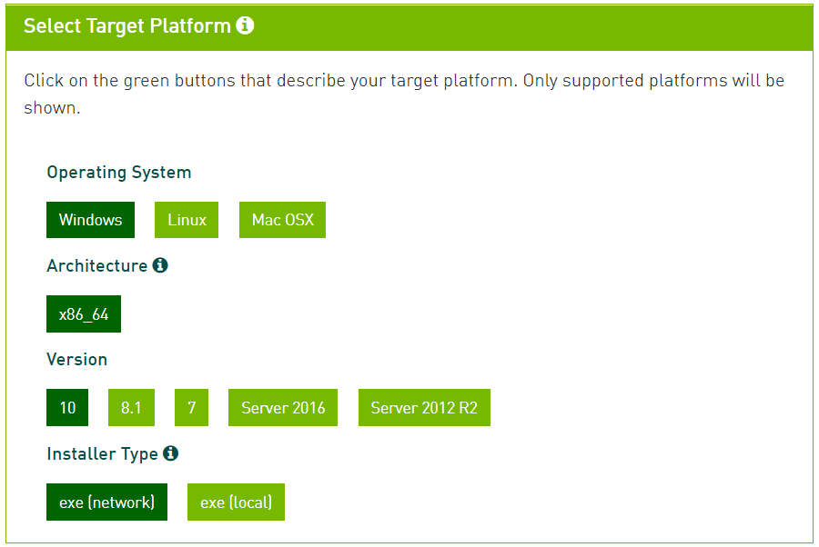

# Darknet 環境構築 on Windows

[kazuya0202/setup-datknet](https://github.com/kazuya0202/setup-darknet.git)を移植したものです。

::: warning NOTE

Visual Studio 2019に対応していないため、2013 ～ 2017を使う必要があります。

:::

| ライブラリ | バージョン |
| :--------: | :--------: |
|    CUDA    |    10.0    |
|   cuDNN    |   7.6.1    |
|   OpenCV   |   3.4.6    |

## CUDA セットアップ

1. [NVIDIA Toolkit - CUDA10.0 Archive](https://developer.nvidia.com/cuda-10.0-download-archive?target_os=Windows&target_arch=x86_64&target_version=10&target_type=exenetwork)からインストーラをダウンロード

2. Version : `10` ／ Installer Type : `exe [network]` を選択し、**Base Installer** をダウンロード

   > 

3. ダウンロードしたインストーラを起動

4. 展開先フォルダの指定

   > デフォルトのままで`[OK]`をクリックする。

5. ライセンスの確認

   >  `[同意して実行する]`をクリックする。

6. インストールオプション

   > `[カスタム (詳細)]`を選択し、`[次へ]`をクリックする。

7. カスタムインストールオプション（コンポーネントの選択）

   > デフォルトのままで`[次へ]`をクリックする。
   >
   > ::: warning 複数バージョンの CUDA Toolkit をインストールする場合
   >
   > **古いバージョン**の CUDA Toolkit をインストールするときは`[CUDAだけ]`を選択する。（`[CUDA]`以外のコンポーネントはチェックを外す）
   >
   > :::

8. インストール場所を選択

   > デフォルトのままで`[次へ]`を選択する。

9. インストール

   > このとき、Windows セキュリティの画面が開いた場合`[インストール]`をクリックする。
   >
   > ::: warning インストールが失敗した場合
   >
   > 失敗したときは、もう一度インストーラを起動し、インストールするコンポーネントを必要なものに絞ってインストールする。
   >
   > :::

10. Nsight Visual Studio

    > Visual Studio がインストール済みのときは、`Nsight for Vusual Studio`がインストールされたことが確認できる。

11. インストール終了の確認

    > `[閉じる]`をクリックする。（ショートカットの作成などは任意）
    >
    > ::: tip TIP
    >
    > 再起動が必要な場合、再起動する。
    >
    > :::
    >
    > ::: tip GeForce Experienceが開いた場合
    >
    > <br>
    >
    > + `[同意 / 実行]`をクリックする
    > + リリースハイライトは`[×]`（ウィンドウを閉じる）
    > + `GPU向けの新しいドライバーが入手可能`と表示された場合は、新しいドライバをインストールする
    >
    > <br>
    >
    > :::

12. 環境変数が設定されていることを確認

    > + **システム環境変数 PATH**
    >
    > ```
    > C:\Program Files\NVIDA GPU Computing Toolkit\CUDA\v10.0\bin
    > C:\Program Files\NVIDA GPU Computing Toolkit\CUDA\v10.0\libnvvp
    > ```
    >
    > ::: warning NOTE
    >
    > 複数バージョンのCUDAをインストールする場合、新しいバージョンの環境変数が上にくるように調整する。
    >
    > :::
    >
    > <br>
    >
    > + **システム環境変数 CUDA_PATH**
    >
    > ```
    > C:\Program Files\NVIDIA GPU Computing Toolkit\CUDA\v10.0
    > ```
    >
    > ::: tip TIP
    >
    > 複数バージョンの CUDA Toolkit をインストールしている場合は、最後にインストールしたものが設定される。
    >
    > :::
    >
    > <br>
    >
    > + **システム環境変数 CUDA_PATH_V10_0**
    >
    > ```
    > C:\Program Files\NVIDIA GPU Computing Toolkit\CUDA\v10.0
    > ```

13. `nvcc`にパスが通っていることを確認

    > コマンドプロンプトなどで以下を実行する。
    >
    > ```sh
    > $ where nvcc
    > ```
    >
    > パスが表示されればOK。

## cuDNN セットアップ

1. [cuDNN - Download](https://developer.nvidia.com/rdp/form/cudnn-download-survey)へアクセス

2. `[Join]`を選択し、**NVIDIA Developer** のチームに入る（アカウントは各自作成 / Googleなどからログイン）

3. `I Agree To the Teams ...`のチェックボックスをクリック

4. `[Download cuDNN v7.6.1 (June 24, 2019) for CUDA 10.0]`をクリック

5. `[cuDNN Library for Windows 10]`をクリックし、zipファイルをダウンロード

6. ダウンロードしたファイルを展開

7. 展開したフォルダ内の`bin` / `include` / `lib`フォルダを`C:\Program Files\NVIDIA GPU Computing Toolkit\CUDA\v10.0`に移動（binフォルダのファイルはbinフォルダに移動）

   ```sh
   */cudnn../bin     -> */v10.0/bin
   */cudnn../include -> */v10.0/include
   */cudnn../lib     -> */v10.0/lib
   ```

## OpenCV セットアップ

1. [OpenCV - Releases](https://opencv.org/releases/)からバージョン`3.4.6`の`Windows`をダウンロード

   > ::: tip TIP
   >
   > 3.4.6でなくても3.x.xならOK。
   >
   > :::

2. インストーラを起動

3. インストール先を指定

   >  ここでは、`C:\`にインストールする。
   >
   > ::: tip TIP
   >
   > フォルダ名を`opencv_346`などのようにバージョンが分かるようにリネームしておくほうが、バージョンが増えたとき管理しやすい。
   >
   > :::

4. 環境変数の設定

   > +  `[コントロールパネル]` > `[システムとセキュリティ]` > `[システム]` > `[システムの詳細設定]` > `[環境変数]` > `[システム環境変数]` > `[Path]` > `[編集]` > `[新規]`
   > + 以下を設定する
   >
   > ```
   > C:\opencv_346\build\x64\vc15\bin
   > ```
   >
   > ::: warning NOTE
   >
   > フォルダ名を変更した場合は、変更後のフォルダ名をパスとして追加する。
   >
   > :::

## Darknet

1. [alexeyAB/darknet](https://github.com/alexeyAB/darknet.git)をCloneまたはzipをダウンロード（zipをダウンロードした場合は、展開までする）

2. `darknet\build\darknet`に移動

3. `darknet.sln`を起動

   > ::: warning NOTE
   >
   > Visual Studio 2017以下のバージョンで起動する。
   >
   > :::
   >
   > ソリューション操作の再ターゲットが出た場合は、`[OK]`をクリック

4. ソリューション（darknet）を右クリック > `[プロジェクトの再ターゲット]` > `[OK]`

   > 

5. 一度ビルドする

   > + ビルドを`Release` / `x64`にする
   >
   > 
   >
   > <br>
   >
   > + `Ctrl + Shift + B` （`[メニューバー]` > `[ビルド]` > `[ソリューションのビルド]`）でソリューションをビルドする
   >
   > ::: tip TIP
   >
   > このとき、OpenCV の設定がうまくいかずエラーが発生するがそのまま。
   >
   > :::

6. ソリューション（darknet）を右クリック > `[プロパティ]`

   > + **インクルードディレクトリの設定**
   >
   > 1. `[C/C++]` > `[全般]` > `[追加のインクルードディレクトリ]` > `[▼]` > `[編集]`
   >
   >    
   >
   > 2. 2行目の`C:\opencv_3.0\...`を自分の環境での OpenCV のパスに変更する
   >
   >    ```
   >    C:\opencv_346\build\include
   >    ```
   >
   >    
   >
   > <br>
   >
   > + **リンカーの追加ライブラリディレクトリの設定**
   >
   > 1. `[リンカー]` > `[追加のライブラリディレクトリ]` > `[▼]` > `[編集]`をクリックする
   >
   > 
   >
   > 2. 先ほどと同様に、3行目を自分の環境のパスに変更する
   >
   >    ```
   >    C:\opencv_346\build\x64\vc15\lib
   >    ```
   >
   >    
   >
   > + **ビルドの依存関係の設定**
   >
   > 1. ソリューションを右クリック > `[ビルドの依存関係]` > `[ビルドのカスタマイズ]`
   >
   >    
   >
   > 2. すでについているチェックを外し、`[CUDA 10.0]`を選択して`[OK]`をクリック
   >
   >    

7. 再度ソリューションをビルド

   > 成功した場合は、`darknet/build/darknet/x64/`フォルダの中に`darknet.exe`ができている。
   >
   > ::: tip TIP
   >
   > 成功しない場合は、手順をやり直す。
   >
   > Visual Studioの関係でエラーが出ている可能性もあるかも。
   >
   > :::

9. ビルドが正常にできたかどうか検証

   > 下記のコマンドを実行。
   >
   > ```sh
   > # dir: ~\darknet\build\darknet\x64\
   > .\darknet.exe
   >
   ># => usage: .\darknet <function>
   > ```
   >
   > 上のような結果が得られれば、正常にビルドされている。
