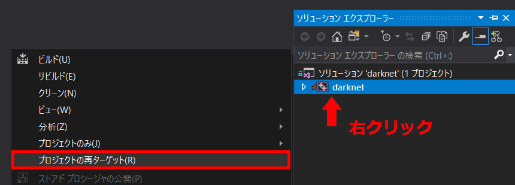
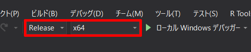
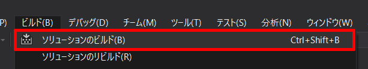
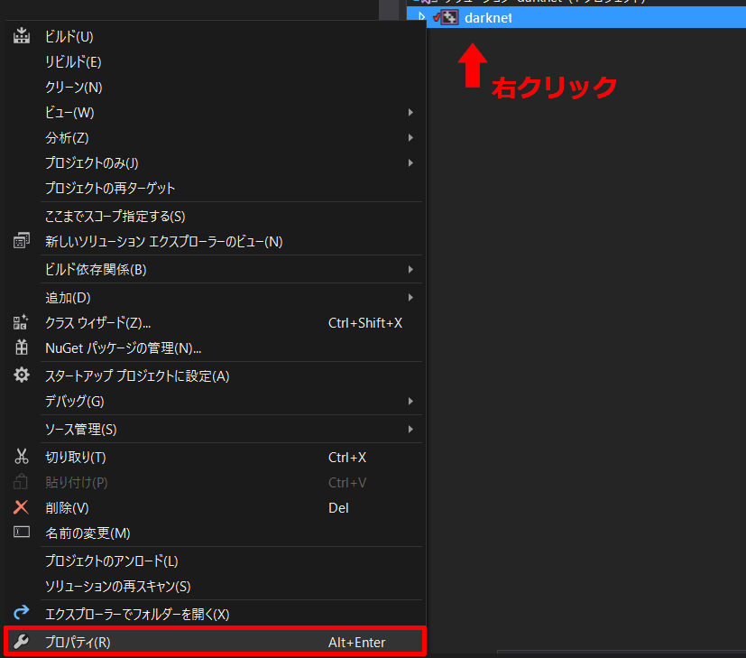
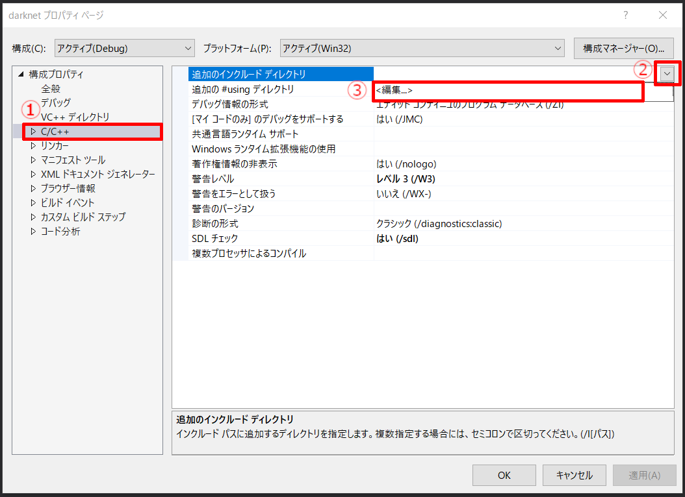
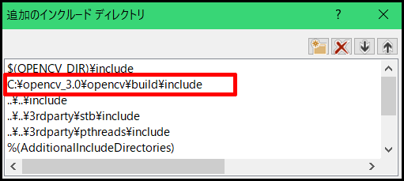
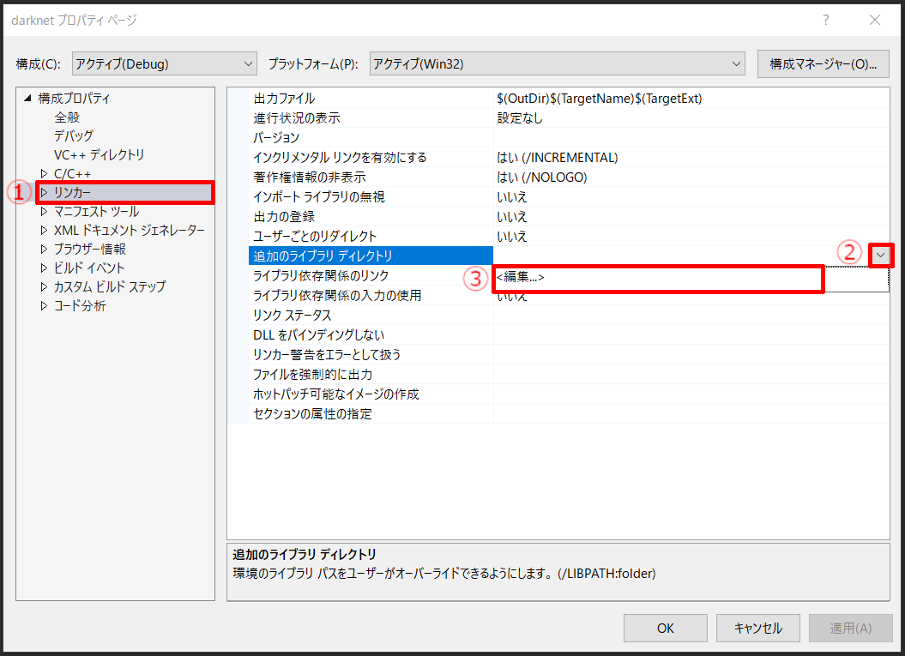
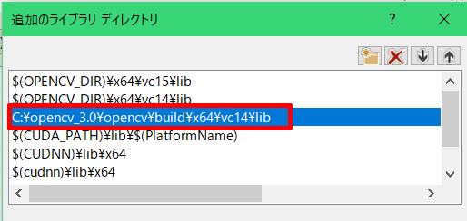
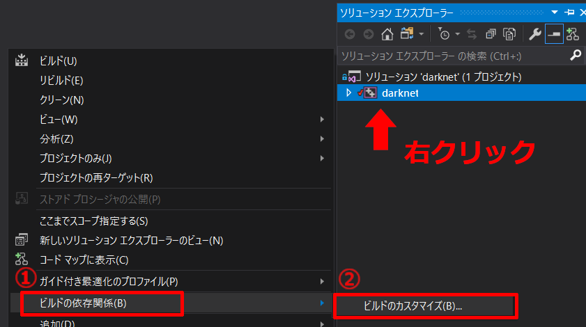
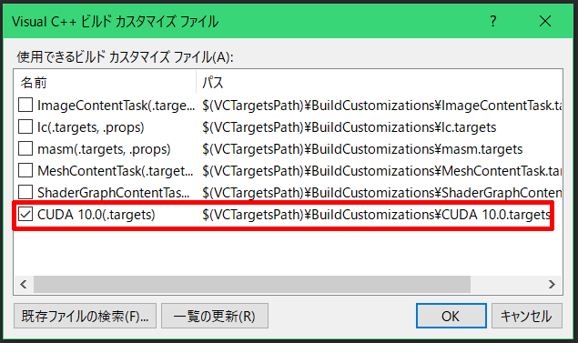

# Darknet 環境構築 on Windows

[kazuya0202/setup-datknet](https://github.com/kazuya0202/setup-darknet.git)を移植したものです。

::: warning NOTE

Visual Studio 2019に対応していないため、2013 ～ 2017を使う必要があります。

:::

| ライブラリ | バージョン |
| :--------: | :--------: |
|    CUDA    |    10.0    |
|   cuDNN    |   7.6.5    |
|   OpenCV   |   3.4.6    |

<br>

## VS2017 のインストール

Visual Studio をインストールしていない、もしくは VS 2019 以前をインストールしていない場合は、[VS2017 - Release Notes](https://docs.microsoft.com/ja-jp/visualstudio/releasenotes/vs2017-relnotes) からVS2017をインストールする。


<br>

## CUDA セットアップ

[CUDA](https://ichiya.netlify.com/posts/2020/02/29/_20200229.html#cuda) 参照。

::: tip

Version: 10.0

:::

<br>

## cuDNN セットアップ

[cuDNN](https://ichiya.netlify.com/posts/2020/02/29/_20200229.html#cudnn) 参照。

::: tip

Version: 7.6.5

:::

<br>

## OpenCV セットアップ

[OpenCV インストール方法](https://ichiya.netlify.com/posts/2020/03/01/_20200301.html) 参照。

::: warning NOTE

Version: 3.4.6

3.4.6でなくても、3.x.x をインストールする。

:::

<br>

## Darknet

## 1. ダウンロード

[alexeyAB/darknet](https://github.com/alexeyAB/darknet.git) をCloneまたはzipをダウンロード（zipをダウンロードした場合は、展開までする）。

<br>

## 2. ソリューション（.sln）の編集

`darknet\build\darknet\darknet.sln`を起動する。

::: warning NOTE

Visual Studio 2019 以前のバージョンで起動する。

:::

※ ソリューション操作の再ターゲットが出た場合は、`[OK]`をクリック

## <HC/> 2-1. プロジェクトの再ターゲット

ソリューション（darknet）を右クリック > `[プロジェクトの再ターゲット]` > `[OK]`



## <HC/> 2-2. ビルド

ビルド設定を`Release` / `x64`にする



`Ctrl + Shift + B` （`[メニューバー]` > `[ビルド]` > `[ソリューションのビルド]`）でソリューションをビルドする



::: tip TIP

このとき、OpenCV の設定がうまくいかずエラーが発生するがそのまま。

:::

## <HC/> 2-3. プロパティの編集

ソリューション（darknet）を右クリック > `[プロパティ]`



### <HC text="●"/> インクルードディレクトリの設定

1. 編集画面を開く。

   `[C/C++]` > `[追加のインクルードディレクトリ]` > `[▼]` > `[編集]`

   

2. 2行目の`C:\opencv_3.0\...`を自分の環境での OpenCV のパスに変更する。

   ```
   C:\opencv\build\include  # 例
   ```

   

### <HC text="●"/> リンカーの追加ライブラリディレクトリの設定

1. 編集画面を開く。

   `[リンカー]` > `[追加のライブラリディレクトリ]` > `[▼]` > `[編集]`

   

2. 先ほどと同様に、3行目を自分の環境のパスに変更する

   ```
   C:\opencv_346\build\x64\vc15\lib  # 例
   ```

   

### <HC text="●"/> ビルドの依存関係の設定

1. ソリューションを右クリック > `[ビルドの依存関係]` > `[ビルドのカスタマイズ]`

   

2. `[CUDA 10.0]`を選択して`[OK]`をクリック

   

## 2-4. 再ビルド

成功した場合は、`darknet/build/darknet/x64/`フォルダの中に`darknet.exe`ができている。

::: tip TIP

成功しない場合は、手順をやり直す。

何度やっても`nvcc.exe`関連のエラーが出る場合は、Visual Studio自体、もしくはPC自体に問題がある。

:::

<br>

## 3. 確認

`darknet\build\darknet\x64\`にディレクトリを移動して、下記のコマンドを実行する。

```sh
$ .\darknet.exe
# => usage: .\darknet <function>
```

上のような結果が得られれば、正常にビルドされている。