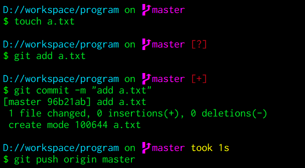
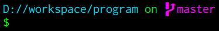
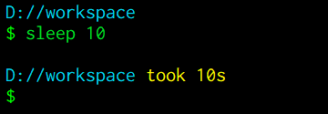
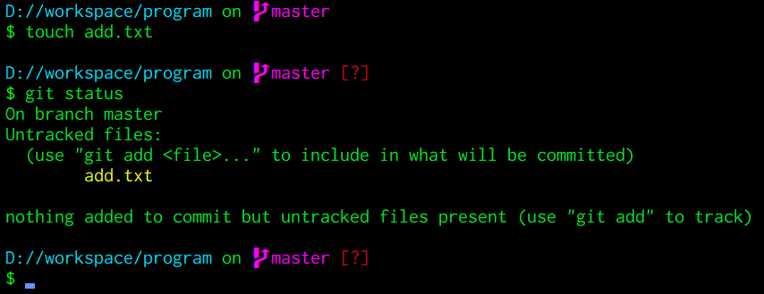

# Starshipを使ってプロンプトをいい感じにする

StarshipがScoopでインストールできるようになったので紹介します。

Rust製なので速度も速く、カスタマイズもできます。

いろいろなシェル（`Bash |Fish | Zsh | Powershell`）にも対応しています。

> Starship（公式）：[https://starship.rs/ja-JP/](https://starship.rs/ja-JP/)



<br>

## インストール

前までは、WindowsだとCargoでしかインストールできなかったので、Scoopが使えるようになってかなり手軽になりました。

（いつの間にか日本語のドキュメントも出てました。）

RustインストールしてるからCargo使える！って人も、Cargoだとビルドに失敗することもあるので、その時はおとなしくScoopを使いましょう...

+ Scoop

```sh
scoop install starship
```

+ Cargo

```sh
cargo install starship
```

<br>

## 適用

`~/.bashrc`にStarshipを実行する処理を書きます。

```sh
# ~/.bashrc

eval "$(starship init bash)"
```

::: tip PowerShellに適用する

`Profile.ps1`に処理を書きます。（※ ファイルがない場合は作成してください。）

```powershell
# ~/Documents/WindowsPowerShell/Profile.ps1

Invoke-Expression (&starship init powershell)
```

:::

<br>

## Powerline

StarshipはPowerline対応なので、Powerlineフォントを設定します。

設定しておくとGitリポジトリ内で、以下みたいないい感じの表示になります。



<br>

## 機能紹介（一部）

### <HC/> コマンドの実行時間

コマンドを実行してから経過した時間を表示してくれます。

ということは、プログラム全体の経過時間を計るとき、内部で実装しなくてもよくなる？



### <HC/> Git の状態

下の画像のように、ファイルを追加すると`[?]`が付きます。

ほかにも、変更があった場合は`[!]`で表示してくれたりしてくれます。

プッシュし忘れ防止にもなるかも？



<br>

ほかにもいろいろ機能があります。

詳細は[公式](https://starship.rs/ja-JP/config/)を参照してください。

<br>

## カスタマイズ

コマンドの実行時間がN秒を超えたら表示するように変更したり、ディレクトリのパスを5つまでに制限したりいろんなことができます。

詳細は[公式](https://starship.rs/ja-JP/config/)を...

<br>

## おわりに

プロンプトの画面が変わるだけでも、モチベーションが上がる（？）ので興味ある人はやってみてください。

プロンプト使って作業している人は、かなり恩恵を受けられると思うのでぜひ！
