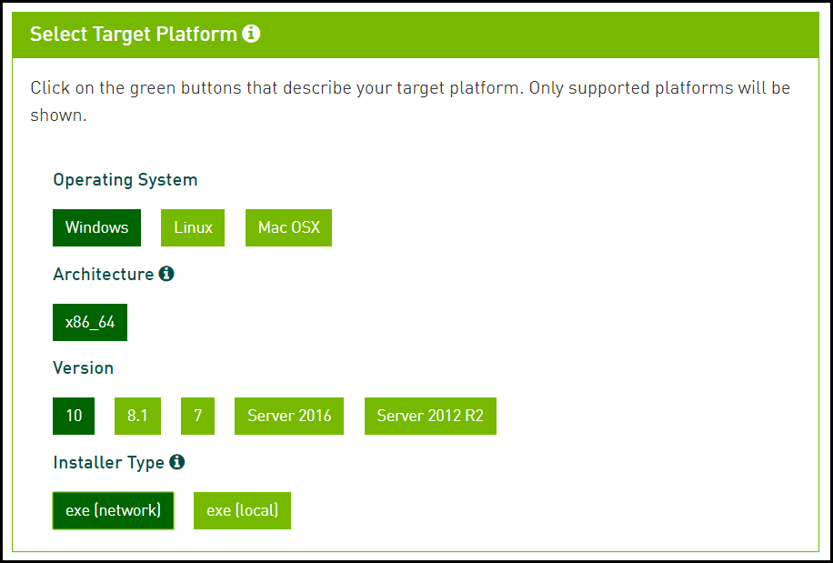
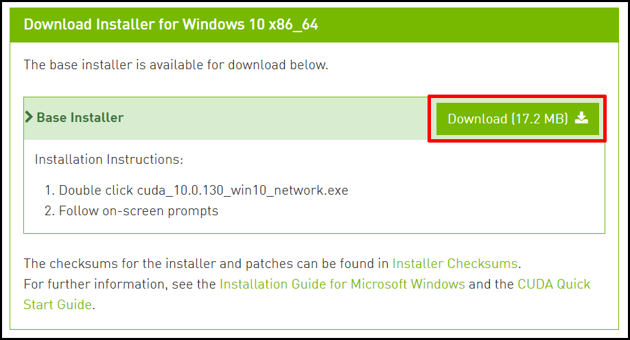
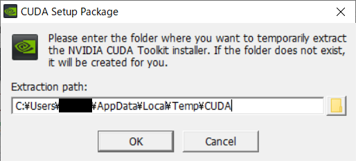
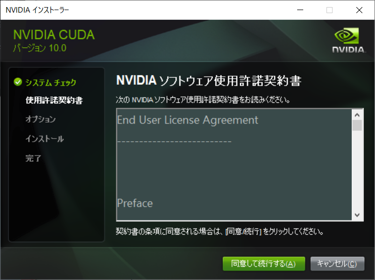
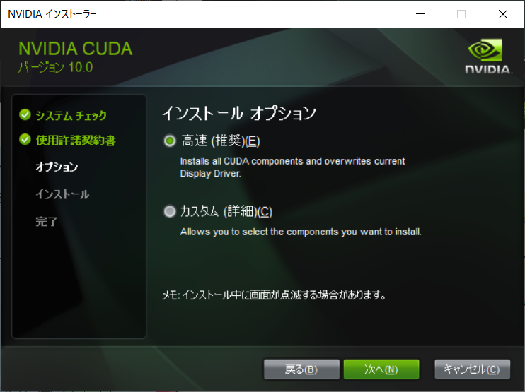
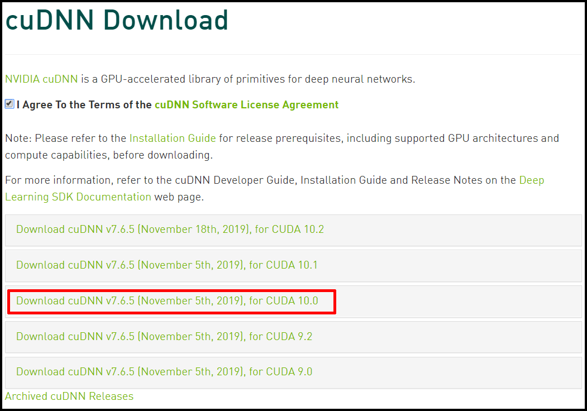
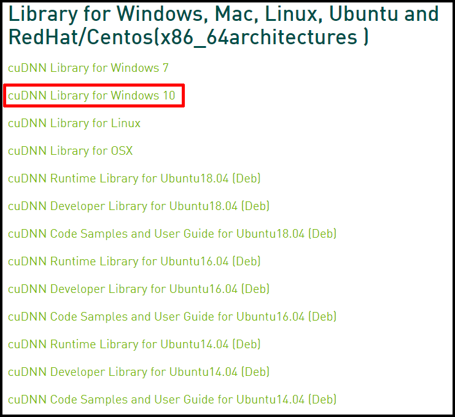

WindowsでGPUを使う際に、必須となるCUDA・cuDNNのセットアップ方法について紹介します。

::: tip TIP - インストールするバージョン

ここでは、`CUDA` は v10.0、

`cuDNN` は v7.6.5 をインストールする。

:::

<br>

## CUDA

## 1. インストーラのダウンロード

1. [NVIDIA Toolkit - CUDA10.0 Archive](https://developer.nvidia.com/cuda-10.0-download-archive) からバージョンを選択する。

   ::: tip

   v10.0 以外をインストールしたい場合は、[Archive](https://developer.nvidia.com/cuda-toolkit-archive) からバージョンを選択する。

   :::

   

   ▲構成例

2. ダウンロードを開始する。

   

<br>

## 2. インストーラの実行

## <HC/> 2-1. 展開先フォルダの指定

デフォルトのままで`[OK]`をクリックする。



## <HC/> 2-2. ライセンスの確認

`[同意して実行する]`をクリックする。



## <HC/> 2-3. インストールオプション

::: warning 複数バージョンのCUDAをインストールする場合

<u>[複数バージョンのCUDAをインストールするときの注意点](https://ichiya.netlify.com/posts/2020/02/29/_20200229-2.html)</u> を参照。

:::

 `[高速 (推奨)]`を選択し、`[次へ]`をクリックする。

インストール完了を待つ。

※ このとき、Windows セキュリティの画面が開いた場合`[インストール]`をクリックする。



## (<HC/> 2-4. Nsight Visual Studio)

Visual Studio がインストール済みのときは、`Nsight for Vusual Studio`がインストールされる。

## <HC/> 2-5. インストール終了の確認

`[閉じる]`をクリックする。（ショートカットの作成などは任意）

::: tip TIP

再起動が必要な場合、再起動する。

:::

::: tip GeForce Experienceが開いた場合

`[同意 / 実行]`をクリックする。  
リリースハイライトは`[×]`をクリックする。  
`GPU向けの新しいドライバーが入手可能`と表示された場合は、新しいドライバをインストールする。

:::

## <HC/> 2-6. 環境変数の確認

`システム環境変数の設定`を開いて確認する。

+ システム環境変数 PATH

    ```
    C:\Program Files\NVIDA GPU Computing Toolkit\CUDA\v10.0\bin
    C:\Program Files\NVIDA GPU Computing Toolkit\CUDA\v10.0\libnvvp
    ```

+ システム環境変数 CUDA_PATH

    ```
    C:\Program Files\NVIDIA GPU Computing Toolkit\CUDA\v10.0
    ```

* システム環境変数 CUDA_PATH_V10_0

    ```
    C:\Program Files\NVIDIA GPU Computing Toolkit\CUDA\v10.0
    ```

## <HC/> 2-7. `nvcc`コマンドの確認

コマンドプロンプトなどで以下を実行し、パスが表示されればOK。

```sh
$ where nvcc
# => C:\Program Files\NVIDIA GPU Computing Toolkit\CUDA\v10.0\bin\nvcc.exe
```

<br>

## cuDNN

## 1. ダウンロード

1. [cuDNN - Download](https://developer.nvidia.com/rdp/form/cudnn-download-survey)へアクセスし、`[Join now]`をクリックする。

   

2. `Login with your social account>`をクリックし、ログインする。（アカウント作成 or Googleなどからログイン）

   ::: tip

   Googleアカウントをもっている人は、Googleからのログインが簡単。

   :::

   

3. `NVIDIA Developer Program`が表示されたら、もう一度[cuDNN - Download](https://developer.nvidia.com/rdp/form/cudnn-download-survey)にアクセスする。

4. `I Agree To ...`にチェックを入れて、インストールしたCUDAのバージョンに対応するバージョンを選択する。

   ※ ここでは、CUDA 10.0に対応する cuDNN v7.6.5。

   

5. `[cuDNN Library for Windows 10]`をクリックすると、zipファイルのダウンロードが始まる。

   

## 2. ファイルの移動

1. ダウンロードしたファイルを展開する。

2. 展開したフォルダ内の`bin` / `include` / `lib`フォルダを`C:\Program Files\NVIDIA GPU Computing Toolkit\CUDA\v10.0`に移動する。

   ::: tip

   展開後の`CUDA`フォルダを、`C:\Program Files\NVIDIA GPU Computing Toolkit`にD&Dすることでも、`bin, include, lib`をまとめて移動可能。

   :::

   ```sh
   # binフォルダのファイルはbinフォルダに移動
   
   ~/cudnn*/bin     -> ~/v10.0/bin
   ~/cudnn*/include -> ~/v10.0/include
   ~/cudnn*/lib     -> ~/v10.0/lib
   ```

