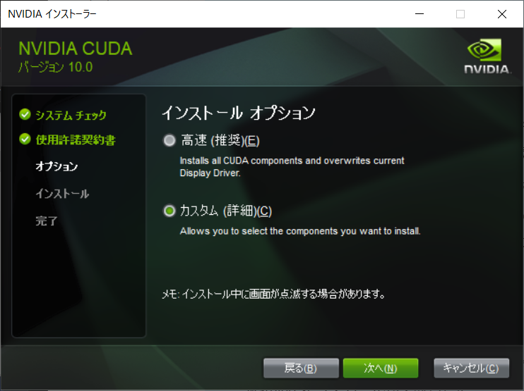
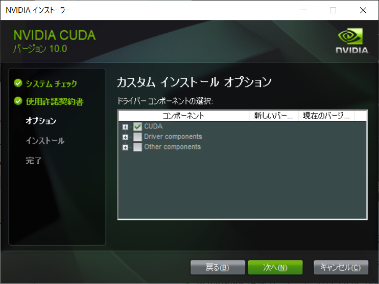

CUDAを複数入れなければならないときに、注意することを紹介します。

 

## 注意点 2つ

+ インストーラ起動時
+ インストール後（環境変数）

 

## 1. インストーラ起動時

1. `[高速 (推奨)]`ではなく、`[カスタム (詳細)]`を選択し、`[次へ]`。

   

2.  `CUDA`以外の、チェックボックスをすべて外して、`[次へ]`。

   

3. インストール場所の選択

   特に変更する必要はないため、デフォルトのままで`[次へ]`。

 

::: warning インストールが失敗した場合

失敗したときは、もう一度インストーラを起動し、インストールするコンポーネントを必要なものに絞ってインストールする。

:::

 

## 2. インストール後（環境変数）

複数バージョンの CUDA Toolkit をインストールしている場合は、最後にインストールしたものが設定される。

使用したいバージョンの環境変数が上にくるように調整する。