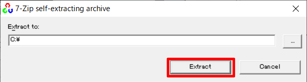

OpenCVのインストール方法を紹介します。

## バージョン

ここでは、`3.4.6`をインストールする。

## 手順

## 1. インストーラのダウンロード

[OpenCV - Releases](https://opencv.org/releases/) からインストールしたいバージョン・プラットフォームのものをダウンロードする。


<br>

## 2. インストール

インストーラを起動後、インストールする場所を指定、`[Extract]`をクリックし、インストールする。

ここでは、`C:\`を指定する。



<br>

## 3. 環境変数の設定

インストールした、OpenCVの`bin`フォルダを環境変数に設定する。

```sh
# 例
C:\opencv\build\x64\vc15\bin
```

### <HC/> 確認

環境変数が設定できたかどうかは、以下のコマンドで確認する。

```sh
$ where opencv_version
# => C:\opencv\build\x64\vc15\bin
```

インストールしたパスが表示されればインストール完了。

